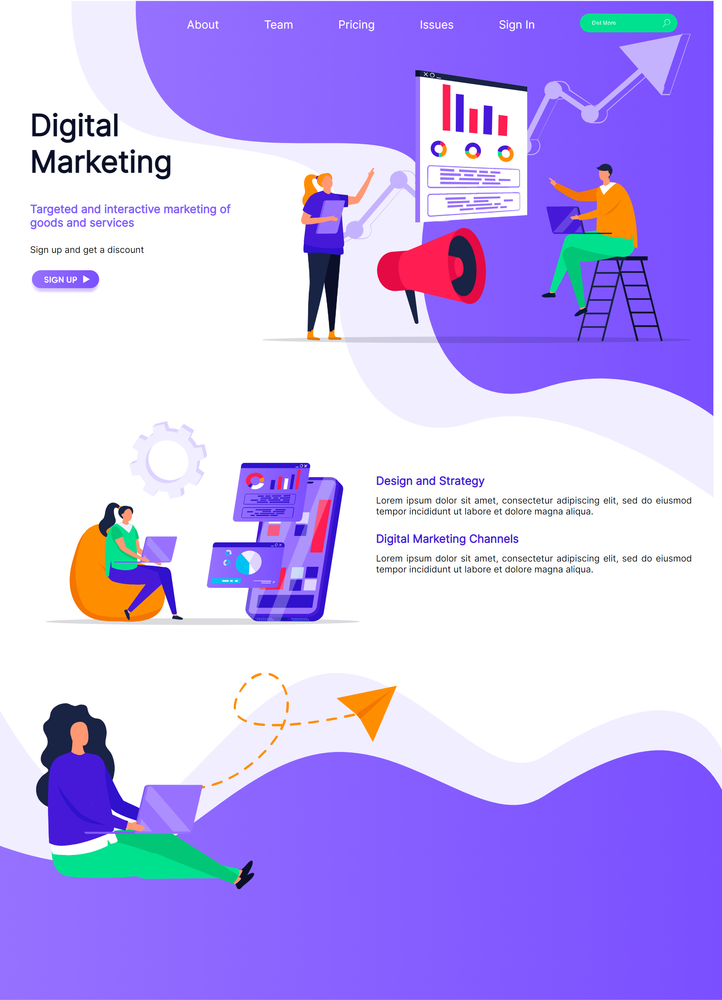

# Internship-Assessment

The task was to create a webpage, reference for which was given through a link(Figma).

## Try it yourself

https://assignment-47.netlify.app/

## Technologies Used

HTML5 
SASS/CSS3 
JavaScript

## Screenshots

### Web View

    

### Mobile View

    

